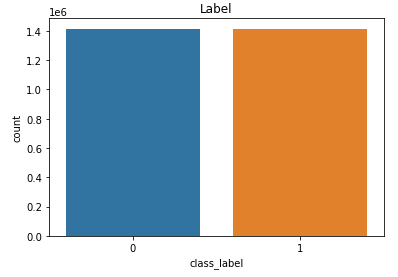
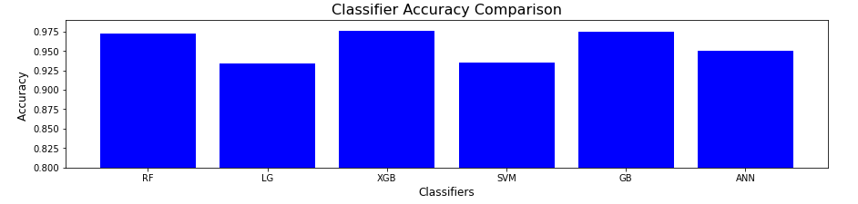
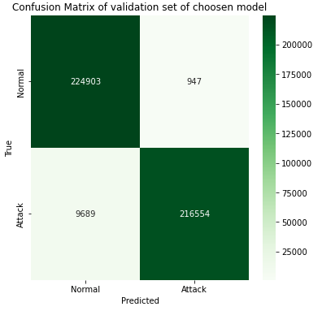
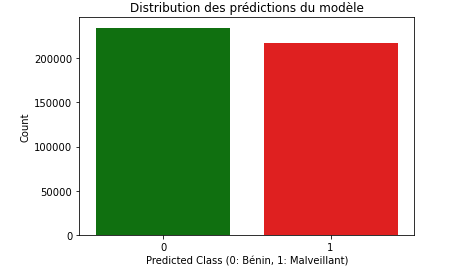
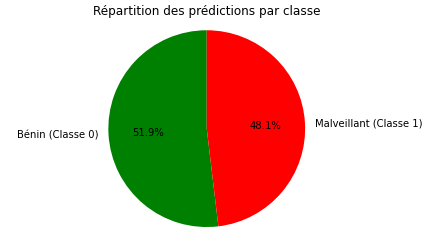
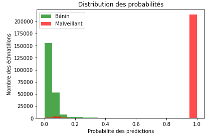
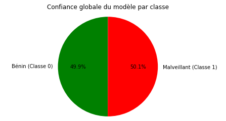
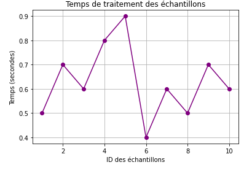

<h1>Intrusion Detection System for Network Traffic</h1>
The use of binary classification models to distinguish malicious traffic from benign traffic at the network level provides significant advantages for businesses in terms of cybersecurity. 
The goal of this project is to develop a binary classification system capable of detecting malicious or benign network traffic by analyzing network data such as communication protocol, duration, source and destination ports, bytes exchanged, etc.

<h2>Step 1: Data Extraction, Loading, and Transformation on AWS Cloud Infrastructure</h2>
First, we begin with the extraction of data from several sources: logs, datasets:
<ul>
  <li>CICIDS 2018</li>
  <li>KDD CUP 1999</li>
  <li>UNSW-NB 15</li>
  <li>Other network traffic datasets + logs</li>
</ul>

The data is stored in the S3 file management system within the AWS cloud infrastructure. 
Next, we process the data within the Redshift data warehouse to centralize the data and create the final dataset that will be used for training.
Ultimately, we obtain a balanced dataset with two types of traffic: (0: benign) and (1: malicious), which will help the model learn to classify the two classes correctly and reduce bias and overfitting that could lead to false predictions.  

<h2>Step 2: Binary Classification Model Training and Evaluation</h2>
In this step, we use Python to train the classification models using the following packages: scikit-learn, pandas, numpy.

<h3>2-1- Data Preparation</h3>
<ol>
  <li>Removing duplicates</li>
  <li>Handling null values and NaNs</li>
  <li>Selecting important features for learning</li>
  <li>Studying correlations between variables</li>
  <li>Analyzing variable variance</li>
  <li>Handling infinite variables</li>
  <li>Creating balanced samples for binary classes: benign, malicious</li>
  <li>Encoding categorical variables</li>
  <li>Normalizing the dataset</li>
</ol>

<h3>2-2- Model Training</h3>
<ol>
  <li>Preparing datasets: training, testing, validation.</li>
  <li>Selecting hyperparameters using grid search.</li>
  <li>Training machine learning models.</li>
  <ol>
    <li>Random Forest</li>
    <li>Logistic Regression</li>
    <li>XGBoost</li>
    <li>SVM</li>
    <li>Gradient Boosting Classifier</li>
    <li>Neural Network with two layers</li>
  </ol>
</ol>

<h3>2-3- Evaluation of Classification Models Using Metrics:</h3>
<ol>
  <li>Accuracy (overall precision)</li>
  <li>Precision (true positive rate among positive predictions)</li>
  <li>Recall (true positive detection rate)</li>
  <li>F1-Score (balance between precision and recall)</li>
  <li>ROC Curve (evaluate the trade-off between recall and false positive rate)</li>
</ol>

<h3>2-4- Choosing the Best Prediction Model</h3>

We will compare the accuracy of each classification model to select the best classifier. 

 

It is observed that the XGBoost model offers the best prediction on the dataset. 

<h3>2-5- Measuring the Performance of the Chosen Model and Interpreting Results</h3>

Next, we evaluate the performance of the chosen model on the validation dataset in the form of graphical models. 
We begin by calculating the confusion matrix, which will help us measure the accuracy, precision, and confidence of the model in correctly classifying traffic and predicting the corresponding network traffic class. 
To clarify these metrics, we introduce some terms here:
<ul>
  <li>True Positive (TP): These are the positive observations that were correctly predicted by the model (or, simply, the observations predicted as “yes” that are actually “yes”).</li>
  <li>True Negative (TN): Similarly, these are the negative observations correctly predicted by the model (observations predicted as “no” and actually “no”).</li>
  <li>False Positive (FP): These are the negative observations incorrectly predicted by the model as positive (a true “no” predicted as a “yes”).</li>
  <li>False Negative (FN): These are the positive observations predicted as negative by the model (a true “yes” predicted as a “no”).</li>
</ul>

<h4>2-5-1- Accuracy Measure</h4>
Accuracy, which is the most intuitive performance measure of a model, can be defined from these terms: it is simply the ratio of correctly predicted observations to the total observations. 
- Accuracy = (TP + TN) / (TP + TN + FP + FN).  
It is a very effective metric for balanced datasets. 
For our project: accuracy = 0.97

<h4>2-5-2- Confusion Matrix</h4>

Confusion matrices are tables that allow us to visualize a model’s performance by displaying the TP, TN, FP, and FN metrics. All observations located on the diagonal of the matrix were correctly predicted by the model, while observations not on the diagonal correspond to errors by the model. A perfect model would have all of its predictions on the diagonal of a confusion matrix. 
The confusion matrix for our model is presented as follows:

<h4>2-5-3- Prediction Distribution Modeling According to Binary Classes</h4>

The bar chart represents the distribution of the predicted classes by the model on the validation dataset. We notice that the classes are almost equal, and the model successfully classifies normal traffic and distinguishes it from malicious traffic. 

 
Similarly, the pie chart more precisely represents the prediction percentage for each class. Since the learning was performed on a balanced dataset, the percentages are also balanced. 

<h4>2-5-4- Measuring the Model's Overall Confidence</h4>
The model assigns a probability to each class (e.g., 0.8 = 80% confidence means that the sample is malicious). A threshold (usually 0.5) is used to classify the samples:
<ul>
  <li>Predicted class = 1 if probability ≥ 0.5</li>
  <li>Predicted class = 0 if probability < 0.5</li>
</ul>

This graph reflects the results of this decision threshold.  
The malicious class has consistently higher probabilities, and the model is able to distinguish the two classes with high confidence.

More generally, the distribution of prediction probabilities by the model for each class is represented in the following circular diagram:  

<h4>2-5-5- Execution Time of the Model Based on Sample Size</h4>

To ensure better model performance, we will calculate its execution time based on the number of samples. This is to allow deployment of the model in a real-time intrusion detection system and network traffic monitoring systems. 
The model exhibits a very short execution time, thus enabling efficient use for real-time detection on streaming data flows or in batch mode. 

 

<h3>References</h3>

<ul>
  <li>http://kdd.ics.uci.edu/databases/kddcup99/kddcup99.html</li>
  <li>https://www.unb.ca/cic/datasets/ids-2017.html</li>
  <li>https://research.unsw.edu.au/projects/unsw-nb15-dataset</li>
</ul>
